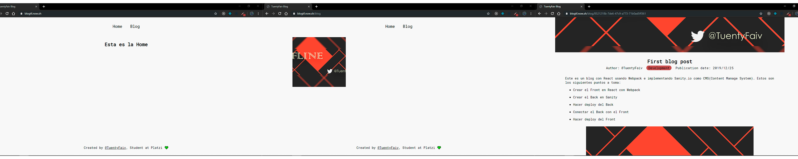

# Este es un blog creado para un tutorial en [Platzi](https://platzi.com/clases/)

Para instalar el proyecto corre el siguiente comando
`npm install`
y para iniciarlo
`npm run dev` 

Así es como se ve el Blog

